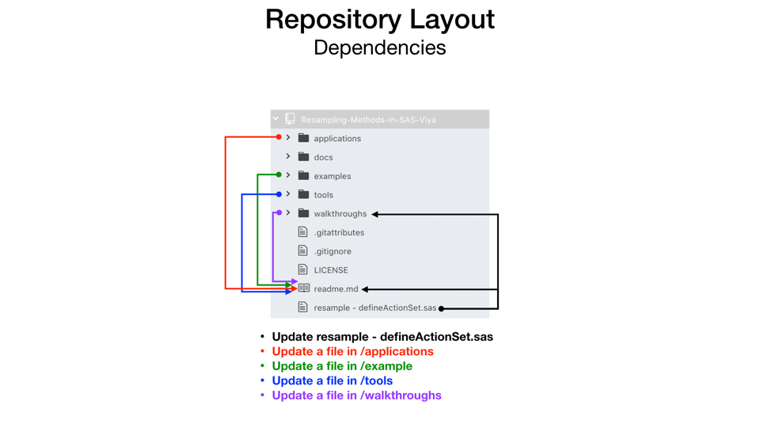
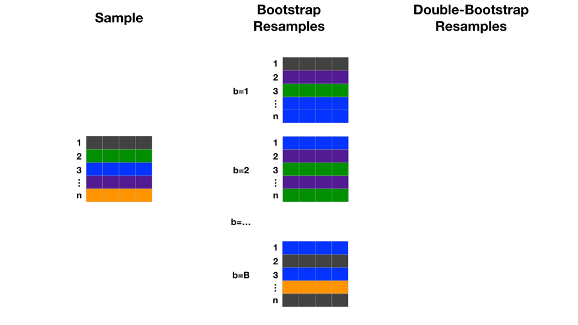
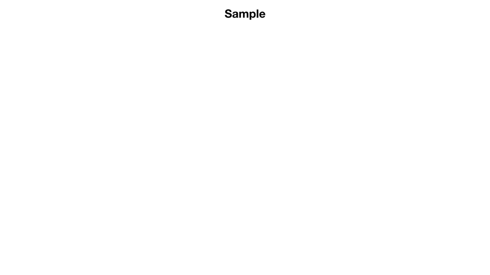

# TODO
- [ ] add stratification to doubleBootstrap

# Resampling Methods in the SAS Viya CAS Engine
This repository contains code, walkthroughs, examples, and applications of bootstrap methods.  It utilizes the computing infrastructure of SAS Viya's CAS engine.  This allows distributed computation of bootstrap iterations in parallel with very minimal code!

### Motivation
When our sample is limited (when isn't it?) and we want to understand parameter estimates, it is desirable to resample the population.  With bootstrapping, we can resample the sample many times to further learn from our sample and assess uncertainty.  The benefit of this project is making the "many times" easy and fast for the user.

For an acknowledgement of the importance of the bootstrap, a great place to start is the writeup for it's inventor being awarded the [International Prize in Statistics](http://statprize.org).  Thank you Professor Efron for putting a computer on the desk (now, the cloud) of every statistician.

### Notes about code
All code is written in SAS CASL which can be executed from a SAS interface with PROC CAS or from the various (Python, R, REST,...) API's.  As of SAS Viya version 3.4 there is not a packaged bootstrap action.  There is an included [Sampling And Partitioning Action Set](https://documentation.sas.com/?cdcId=pgmsascdc&cdcVersion=9.4_3.4&docsetId=casactstat&docsetTarget=casactstat_sampling_toc.htm&locale=en) but it does not have options for sampling with replacement.

This repository has a user defined action set and instructions for loading it in your environment.  This also makes a great example of how to easily extend the capabilities of SAS Viya and share with all users in your environment.

### Contribute
Have something to add?  Just clone or branch it, commit changes, and create a pull request!

Review the section [RepositoryLayout](#Respository-Layout) to understand dependencies in the repository structure.

Have comments, questions, suggestions? Just use the issues feature in GitHub

### Repository layout
As updates are made to the repository there are dependencies between files and folders.  The primary file is `resample - defineActionSet.sas` and any updates to it will require updates in `/walkthroughs` and `Readme.md`.  Some folders and files are standalone like `/tools` and `/applications` but additions still need to be added to `Readme.md`.  Also, `/examples` may need to be updated if the actions calls are updated with parameter changes.



### Contents of the repository
* [resample - defineActionSet.sas](./resample%20-%20defineActionSet.sas) The resample actionset definition file.
* Folder: [examples](./examples) contains examples of using the actions
  * [example 1 - loading and using bootstrap action from resample.sas](./examples/example%201%20-%20loading%20and%20using%20bootstrap%20action%20from%20resample.sas)
  * [example 2 - regression bootstrap parameter estimates.sas](./examples/example%202%20-%20regression%20bootstrap%20parameter%20estimates.sas)
    * [example 2_1 - bootstrap confidence intervals for individual predictions.sas](./examples/example%202_1%20-%20bootstrap%20confidence%20intervals%20for%20individual%20predictions.sas)
  * [example 3 - regression double-bootstrap parameter estimates.sas](./examples/example%203%20-%20regression%20double-bootstrap%20parameter%20estimates.sas)
    * [example 3_1 - double-bootstrap confidence intervals for individual predictions.sas](./examples/example%203_1%20-%20double-bootstrap%20confidence%20intervals%20for%20individual%20predictions.sas)
  * [example 4 - regression jackknife parameter estimates.sas](./examples/example%204%20-%20regression%20jackknife%20parameter%20estimates.sas)
    * [example 4_1 - jackknife confidence intervals for individual predictions.sas](./examples/example%204_1%20-%20jackknife%20confidence%20intervals%20for%20individual%20predictions.sas)
  * [example 5 - using bootstrap results to diagnose influence with model fit.sas](./examples/example%205%20-%20using%20bootstrap%20results%20to%20diagnose%20influence%20with%20model%20fit.sas)
  * [example 6 - using bootstrap results to diagnose influence with model accuracy.sas](./examples/example%206%20-%20using%20bootstrap%20results%20to%20diagnose%20influence%20with%20model%20accuracy.sas)
  * [example 7 - residual bootstraping.sas](./examples/example%207%20-%20residual%20bootstraping.sas)
    * [example 7_1 - residual bootstraping confidence intervals for individual predictions.sas](./examples/example%207_1%20-%20residual%20bootstraping%20confidence%20intervals%20for%20individual%20predictions.sas)
* Folder: [walkthroughs](./walkthroughs) contains step-by-step commented versions of the code within the actions to help understand how they work.  This is great for learning!
  * [walkthrough - addRowID action.sas](./walkthroughs/walkthrough%20-%20addRowID%20action.sas)
  * [walkthrough - bootstrap action.sas](./walkthroughs/walkthrough%20-%20bootstrap%20action.sas)
  * [walkthrough - doubleBootstrap action.sas](./walkthroughs/walkthrough%20-%20doubleBootstrap%20action.sas)
  * [walkthrough - jackknife action.sas](./walkthroughs/walkthrough%20-%20jackknife%20action.sas)
  * [walkthrough - percentilePE.sas](./walkthroughs/walkthrough%20-%20percentilePE.sas)
* Folder: [applications](./applications) will soon contain broader applications of the actions
* Folder: [upcoming](./upcoming) contains walkthroughs and examples in development (undocumented here)
* Folder: [tools](./tools) a set of stand-alone examples to diagnose and understand the computing environment
  * [walkthrough - working with distributed data.sas](./tools/walkthrough%20-%20working%20with%20distributed%20data.sas)
  * [cas environment layout.sas](./tools/cas%20environment%20layout.sas)

### Setting up the actions in your environment
Run the code in [resample - defineActionSet.sas](./resample%20-%20defineActionSet.sas).  Some lines that may need changing:
* line 1: connects to a CAS session
* To Save the actions for future sessions and use by other users:
  * line 174: create an in-memory table of the action set
  * line 175: persist the in-memory table in .sashdat file.  Here it is pointed as caslib="Public".
* If you need to remove the action set then uncomment and use:
  * line 177: removes the persisted in-memory table

### Actions Instructions
To use the actions you will need to load the user defined actions with:
```SAS
builtins.actionSetFromTable / table={caslib="Public" name="resampleActionSet.sashdat"} name="resample";
```

---
# References
* [Syntax Reference](#Syntax-Reference)
* [Further SAS References (primarily 9.4)](#Further-SAS-References)
* [Method Descriptions](#Method-Desriptions)

---
## Syntax Reference
Table of contents:

* [Relationship Map](#relationship-map)
* [Quickstart Examples](#quickstart-example)
* [resample.addRowID action](#resampleaddRowID-action)
* [resample.bootstrap action](#resamplebootstrap-action)
* [resampe.doubleBootstrap action](#resampledoubleBootstrap-action)
* [resample.jackknife action](#resamplejackknife-action)
* [resample.percentilePE action](#resamplepercentilepe-action)

### Relationship Map
This is a reference chart for the relationship between the actions and their output tables.


### Quickstart Examples

resample.addRowID|resample.bootstrap|resample.doubleBootstrap|resample.jackknife|resample.percentilePE
-----|-----|-----|-----|-----
resample.addRowID /<br/>intable="sample";<br/><br/><br/><br/><br/><br/><br/><br/>|resample.bootstrap /<br/>intable="sample"<br/>Seed=12345<br/>B=100<br/>Bpct=1;<br/>case="unique_case"<br/>strata="strata"<br/>strata_table="tableName"<br/><br/>|resample.doubleBootstrap /<br/>intable="sample"<br/>Seed=12345<br/>B=100<br/>Bpct=1<br/>D=50<br/>Dpct=1<br/>case="unique_case";<br/><br/>|resample.jackknife /<br/>intable="sample"<br/>case="unique_case";<br/><br/><br/><br/><br/><br/><br/>|resample.percentilePE /<br/>intable="sample"<br/>alpha=0.05;<br/><br/><br/><br/><br/><br/><br/>


### resample.addRowID action
Updates the provided table <intable> with a new column named RowID that has a naturally numbered (1,2,...,n) across the distributed in-memory table.
* rowID - is the naturally numbered (1, 2, ..., n) row identifier for the sampled row in `<intable>`

##### Syntax
```
CASL Syntax

    resample.addRowID /
      intable="string"
```
##### Parameter Descriptions

```intable="string"```  
* required  
* Specifies the name of the table in cas


### resample.bootstrap action
Creates a table of bootstrap resamples from table `<intable>` and stores them in a table named `<intable>_bs`.  Runs the addRowID action on the `<intable>` cases.  Columns that describe the link between the bootstrap resamples and the original sample are:
* bsID - is the naturally numbered (1, 2, ..., b) identifier of a resample
* bs_caseID - is the naturally numbered (1, 2, ..., n) case identifier within the value of bsID
* caseID - is the naturally numbered (1, 2, ..., n) case identifier for the resampled case in `<intable>` - see strata
  * strata (if strata= is a column in `<intable>`) - defines subgroups (by groups) in `<intable>` for which caseID numbering is unique.  Each strata levels starts over at caseID=1 and has decimal value representing the unique strata levels: 1.01, 2.01, 3.01 are all for the same strata level (.01) while 1.02, 2.02, 3.02 are all for strata level (.02).
* bag - is 1 for resampled case, 0 for caseID values not resampled within the bsID (will have missing for bs_caseID)

##### Notes on Stratification
The resample.bootstrap action has two input parameters to direct stratification: `strata` and `strata_table`.  If the value of `strata` is not a column in `<intable>` then stratification does not occur and bootstrap resampling proceeds on the full '<intable>'.

The `strata_table` parameter allows you to provide an input table with columns `strata` (same name as in `<intable>` and provided with the `strata` parameter), `strata_n`, and `strata_dist` (optional).

An Example `<strata_table>` might look like:

MyStrata|strata_n
-----|-----
Level 1|10
Level 2|100
Level 3|45

If you want to randomly assign the `strata_n` value for each strata level in each bootstrap resample then use the `strata_dist` parameter to provide input for the [SAS RAND Function](https://documentation.sas.com/?docsetId=lefunctionsref&docsetTarget=p0fpeei0opypg8n1b06qe4r040lv.htm&docsetVersion=9.4&locale=en).

MyStrata|strata_n|strata_dist
-----|-----|-----
Level 1||'normal,0,20'
Level 2||'normal,200,50'
Level 3||'hyper,200,50,50'

Notes on the parameter precedence:  
* The bootstrap action will check for the `strata` variable in `<intable>` and compute the number of observations present for each level.
* If `<strata_table>` does not exist or does not contain the `strata` variable then bootstrap commences with the `<intable>` size for each strata level adjusted by the `Bpct` parameter.
* Else If `<strata_table>` does exist then the `Bpct` parameter is ignored and:
  * Adds any missing levels of `strata` found in the `<intable>` and populates `strata_n`
  * Removes any levels of `strata` not found in `<intable>`
  * If `strata_dist` is present then it is used to calcualte a new `strata_n` for each bootstrap sample
    * Else If `strata_dist` is not provided, then the input value of `strata_n` is used for each bootstrap sample
    * Else If `strata_n` is not provided, then the calculated value from `<intable>` is used for each bootstrap sample

##### Syntax
```
CASL Syntax

    resample.bootstrap /
      intable="string"
      case="string"
      strata="string"
      strata_table="string"
      B=integer
      Bpct=double
      seed=integer
```
##### Parameter Descriptions

```intable="string"```  
* required  
* specifies the name of the table to resample from in CAS

```case="string"```
* required
* Specifies the name of the column from `<intable>` that connects groupings of rows that make up cases.  If the value specified is not a column name in `<intable>` then the rows will be used as individual cases during resampling.

```strata="string"```
* required
* Specifies the name of the column from `<intable>` that is used to partition or group the rows before resampling.  Resampling will happen independently within each level of the strata variable and the Bpct= parameter will apply separately to each strata level.  This essentially acts as a by variable for resampling.  If the value specified is not a column name in `<intable>` then bootstrap sampling proceeds without stratification.

```strata_table="string"```
* required
* Specifies the name of a table `<strata_table>` that is used to specify the sample info for levels of the `strata` variable.  See [Notes on Stratification above](#Notes-on-Stratification).

```B=integer```
* required
* Specifies the desired number of bootstrap resamples.  
* Note: Will look at the number of threads (_nthreads_) in the environment and set the value of bss (resamples per _threadid_) to ensure the final number of bootstrap resamples is >=B.

```Bpct=double```
* required (optional with default=1 in the future)
* The percentage of the number of sample cases (intable) to use as the resample size 1=100%

```seed=integer```
* required (optional with default=0 in the future)
* Sets the seed for random sampling.  If missing, zero, or negative then SAS will compute a default seed.  
* See the [documentation for Call Streaminit](https://go.documentation.sas.com/?cdcId=pgmsascdc&cdcVersion=9.4_3.3&docsetId=lefunctionsref&docsetTarget=p0gw58qo85qp56n1kbpiz50ww8lv.htm&locale=en) for further information on specifying a seed and changing the random-number generator (RNG).

### resample.doubleBootstrap action
Creates a table of bootstrap and double-bootstrap resamples from table `<intable>` and stores them in tables `<intable>_bs` and `<intable>_dbs`.  Runs the addRowID action on the `<intable>` cases.  If the bootstrap action has already been run on table `<intable>` then a table `<intable>_bs` already exist and will be used for double-bootstraping.  Columns that describe the link between the double-bootstrap resamples and the bootstrap resamples are:
* bsID - is the naturally numbered (1, 2, ..., b) identifier of a resample
* dbsID - is the naturally numbered (1, 2, ..., d) identifier of a resample from a bsID
* dbs_caseID - is the naturally numbered (1, 2, ..., n) case identifier within the value of dbsID
* bs_caseID - is the naturally numbered (1, 2, ..., n) case identifier for the resampled case in bsID
* caseID - is the naturally numbered (1, 2, ..., n) case identifier for the resampled case in `<intable>` - see strata
  * strata (if strata= is a column in `<intable>` for a previously run resample.bootstrap call) - defines a subgroup (by group) in `<intable>` for which caseID numbering is unique.  Each strata levels starts over at caseID=1 and has decimal value representing the unique strata levels: 1.01, 2.01, 3.01 are all for the same strata level (.01) while 1.02, 2.02, 3.02 are all for strata level (.02).
  * Note: stratification is not yet available for the doubleBootstrap action.  You can still run the bootstrap action first with stratification and then use the result table for doubleBootstrap technique. This feature is being worked on.
* bag - is 1 for resampled cases, 0 for caseID values not resampled within the bsID (will have missing for bs_caseID)
  * 0 could be a non-resampled row in either the bsID or the dbsID (resampled from bsID)

##### Syntax
```
CASL Syntax

    resample.doubleBootstrap /
      intable="string"
      case="string"
      B=integer
      D=integer
      seed=integer
      Bpct=double
      Dpct=double
```
##### Parameter Descriptions

```intable="string"```  
* required  
* specifies the name of the table to resample from in CAS

```case="string"```
* required
* Specifies the name of the column from `<intable>` that connects groupings of rows that make up cases.  If the value specified is not a column name in `<intable>` then the rows will be used as individual cases during resampling.

```B=integer```
* required
* Specifies the desired number of bootstrap resamples.  Will look at the number of threads (_nthreads_) in the environment and set the value of bss (resamples per _threadid_) to ensure the final number of bootstrap resamples is >=B.
* Note: If you run resample.bootstrap first then you should use the same value of B (it will ignore the value and use the value from the prior bootstrap).
  * If you don't run resample.bootstrap first then resample.doubleBootstrap will run it first.

```D=integer```
* required
* Specifies the desired number of double-bootstrap resamples from each bootstrap resample.

```Bpct=double```
* required (optional with default=1 in the future)
* The percentage of the number of sample cases (intable) to use as the resample size 1=100%

```Dpct=double```
* required (optional with default=1 in the future)
* The percentage of the number of bootstrap resample cases (intable_bs) to use as the double-bootstrap resample size 1=100%
* Note: if Bpct is set to 50% (0.5) and Dpct is set to 100% (1) the the double-bootstrap resamples will still be 50% of the size of the original samples (intable) number of cases

```seed=integer```
* required (optional with default=0 in the future)
* Sets the seed for random sampling.  If missing, zero, or negative then SAS will compute a default seed.
* See the [documentation for Call Streaminit](https://go.documentation.sas.com/?cdcId=pgmsascdc&cdcVersion=9.4_3.3&docsetId=lefunctionsref&docsetTarget=p0gw58qo85qp56n1kbpiz50ww8lv.htm&locale=en) for further information on specifying a seed and changing the random-number generator (RNG).

Note: The number of double-bootstrap resamples is atleast B*D.  For Example: B=1000 and D=1000 yields at least B*D=1000000


### resample.jackknife action
Creates a table of jackknife resamples from table `<intable>` and stores them in table `<intable>_jk`.  Runs the addRowID action on the `<intable>` cases.  There will be J resamples identified with jkID, where J is equal to the number of cases in `<intable>`.  The values of jkID are numbered 1, 2, ... n and each has resampled cases identified by caseID.  When caseID from `<intable>` is equal to jkID the case is deleted/omitted.  
* jkID - is the naturally numbered (1, 2, ..., n) identifier of a resample
* caseID - is the naturally numbered (1, 2, ..., n) case identifier for the resampled case in `<intable>`

##### Syntax
```
CASL Syntax

    resample.jackknife /
      intable="string"
      case="string"
```
##### Parameter Descriptions

```intable="string"```
* required
* specifies the name of the table to resample from in CAS

```case="string"```
* required
* Specifies the name of the column from `<intable>` that connects groupings of rows that make up cases.  If the value specified is not a column name in `<intable>` then the rows will be used as individual cases during resampling.

### resample.percentilePE action
This action creates percentile confidence intervals for parameter estimates.  The action uses the sample table name `<intable>` and expect to find `<intable>`_PE for the full data parameter estimates and one or more of `<intable>`_BS_PE, `<intable>`_DBS_PE, and `<intable>`_JK_PE that are the parameter estimates from fitting the model to the resample data create by the bootstrap, doubleBoostrap, and jackknife actions.  Check [example 2](./examples/example%202%20-%20regression%20bootstrap%20parameter%20estimates.sas), [example 3](./examples/example%203%20-%20regression%20double%20bootstrap%20parameter%20estimates.sas), and [example 4](./examples/example%204%20-%20regression%20jackknife%20parameter%20estimates.sas) for help using this action.

##### Syntax
```
CASL Syntax

    resample.percentilePE /
      intable="string"
      alpha=double
```
##### Parameter Descriptions

```intable="string"```
* required
* specifies the name of the sample table
* The action will look for `<intable>`_BS_PE, `<intable>`_DBS_PE, and `<intable>`_JK_PE.  It expects to also find `<intable>`_PE for the full data.  These are the outputs of parameter estimates from the model action of your choice.  Run the resample action(s) you want then do groupby model fitting with the model action of your choice and use this naming for the PE files.

```alpha=double```
* required
* specifies the alpha level of the two-sided percentile confidence interval that will be constructed.  Provide a value in (0,1).

---
# Further SAS References
* [SAS Support Supplied macros for Bootstrap, Jackknife and some bias and confidence interval computations](http://support.sas.com/kb/24/982.html)
* [The DO Loop Blog: The essential guide to bootstrapping in SAS](https://blogs.sas.com/content/iml/2018/12/12/essential-guide-bootstrapping-sas.html)

---

# Method Descriptions
* Bootstrap
  * Take a sample dataset with rows 1, ..., n.  Create B resamples with replacement from the sample dataset.  Each resample with also have n rows.  Rows included in a resample, b, are called bagged.  Rows not selected for a particular resample, b, are called out-of-bag.

  

* Double-bootstrap
  * First bootstrap as described above to create B resamples.  For each resample, b, do subsequent resamples called double-bootstraps.  Each of these double-bootstraps also have n rows where the rows are sampled with replacement from the corresponding bootstrap sample.

  

* jackknife
  * This resampling technique takes resamples of size n-1 from the original sample of size n.  There will be J=n jackknife resamples where each has N-1 rows and the missing row is j=n.

  

  ---

  # Thank You!  
  # I Appreciate All Feedback!
