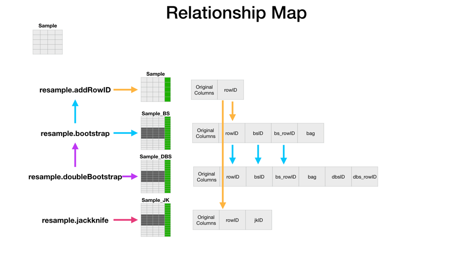
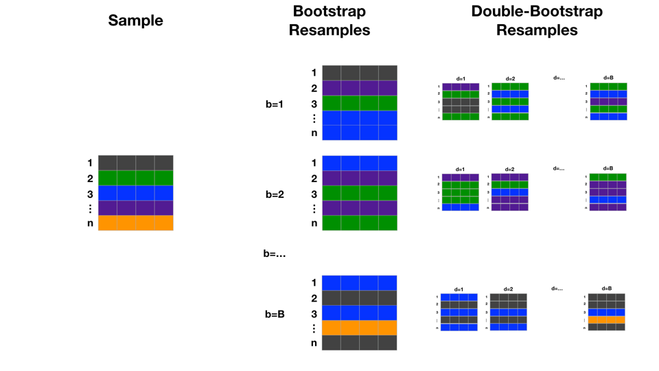

# Resampling Methods in the SAS Viya CAS Engine
This repository contains code, walkthroughs, examples, and applications of bootstrap methods.  It utilizes the computing infrastructure of SAS Viya's CAS engine.  This allows distributed computation of bootstrap iterations in parallel with very minimal code!

### Motivation
When our sample is limited (when isn't it?) and we want to understand parameter estimates, it is desirable to resample the population.  With bootstrapping, we can resample the sample many times to further learn from our sample and assess uncertainty.  The benefit of this project is making the "many times" easy and fast for the user.

For an acknowledgement of the importance of the bootstrap, a great place to start is the writeup for it's inventor being awarded the [International Prize in Statistics](http://statprize.org).  Thank you Professor Efron for putting a computer on the desk (now, the cloud) of every statistician.

### Notes about code
All code is written in SAS CASL which can be executed from a SAS interface with PROC CAS or from the various (Python, R, REST,...) API's.  As of SAS Viya version 3.4 there is not a packaged bootstrap action.  This repository has a user defined action set and instructions for loading it in your environment.  This also makes a great example of how to easily extend the capabilities of SAS Viya and share with all users in your environment.

### Contribute
Have something to add?  Just fork it, change it, and create a pull request!

Have comments, questions, suggestions? Just use the issues feature

### Contents of the repository
* [resample - defineActionSet.sas](./resample%20-%20defineActionSet.sas) The resample actionset definition file.
* Folder: [examples](./examples) contains examples of using the actions
  * [example 1 - loading and using bootstrap action from resample.sas](./examples/example%201%20-%20loading%20and%20using%20bootstrap%20action%20from%20resample.sas)
  * [example 2 - regression bootstrap parameter estimates.sas](./examples/example%202%20-%20regression%20bootstrap%20parameter%20estimates.sas)
  * [example 3 - regression double-bootstrap parameter estimates.sas](./examples/example%203%20-%20regression%20double%20bootstrap%20parameter%20estimates.sas)
  * [example 4 - regression jackknife parameter estimates.sas](./examples/example%203%20-%20regression%20jackknife%20parameter%20estimates.sas)
* Folder: [walkthroughs](./walkthroughs) contains step-by-step commented versions of the code within the actions to help understand how they work.  This is great for learning!
  * [walkthrough - addRowID action.sas](./walkthroughs/walkthrough%20-%20addRowID%20action.sas)
  * [walkthrough - bootstrap action.sas](./walkthroughs/walkthrough%20-%20bootstrap%20action.sas)
  * [walkthrough - doubleBootstrap action.sas](./walkthroughs/walkthrough%20-%20doubleBootstrap%20action.sas)
  * [walkthrough - jackknife action.sas](./walkthroughs/walkthrough%20-%20jackknife%20action.sas)
* Folder: [applications](./applications) will soon contain broader applications of the actions
* Folder: [tools](./tools) a set of stand-alone examples to diagnose and understand the computing environment
  * [walkthrough - working with distributed data.sas](./tools/walkthrough%20-%20working%20with%20distributed%20data.sas)
  * [cas environment layout.sas](./tools/cas%20environment%20layout.sas)

### Setting up the actions in your environment
Run the code in [resample - defineActionSet.sas](./resample%20-%20defineActionSet.sas).  Some lines that may need changing:
* line 1: connects to a CAS session
* To Save the actions for future sessions and use by other users:
  * line 174: create an in-memory table of the action set
  * line 175: persist the in-memory table in .sashdat file.  Here it is pointed as caslib="Public".
* If you need to remove the action set then uncomment and use:
  * line 177: removes the persisted in-memory table

### Actions Instructions
To use the actions you will need to load the user defined actions with:
```SAS
builtins.actionSetFromTable / table={caslib="Public" name="resampleActionSet.sashdat"} name="resample";
```
---
# References
* [Syntax Reference](#Syntax-Reference)
* [Further SAS References (primarily 9.4)](#Further-SAS-References)
* [Method Descriptions](#Method-Desriptions)

---
## Syntax Reference
Table of contents:
* [Relationship Map](#relationship-map)
* [resample.addRowID action](#resampleaddRowID-action)
* [resample.bootstrap action](#resamplebootstrap-action)
* [resampe.doubleBootstrap action](#resampledoubleBootstrap-action)
* [resample.jackknife action](#resamplejackknife-action)

### Relationship Map
This is a reference chart for the relationship between the actions and their output tables.



### resample.addRowID action
Updates the provided table <intable> with a new column named RowID that has a naturally numbered (1,2,...,n) across the distributed in-memory table.
* rowID - is the naturally numbered (1, 2, ..., n) row identifier for the sampled row in `<intable>`

```
CASL Syntax

    resample.addRowID /
      intable="string"

Parameter Descriptions

    intable="string"  
      required  
      Specifies the name of the table in cas
```

### resample.bootstrap action
Creates a table of identically sized bootstrap resamples from table `<intable>` and stores them in a table named `<intable>_bs`.  Runs the addRowID action on the `<intable>`.  Columns that describe the link between the bootstrap resamples and the original sample are:
* bsID - is the naturally numbered (1, 2, ..., b) identifier of a resample
* bs_rowID - is the naturally numbered (1, 2, ..., n) row identifier within the value of bsID
* rowID - is the naturally numbered (1, 2, ..., n) row identifier for the sampled row in `<intable>`
* bag - is 1 for resampled rows, 0 for rowID values not resampled within the bsID (will have missing for bs_rowID)

```
CASL Syntax

    resample.bootstrap /
      intable="string"
      B=integer

Parameter Descriptions

    intable="string"  
      required  
      specifies the name of the table to resample from in CAS
    B=integer
      required
      Specifies the desired number of bootstrap resamples.  
        Will look at the number of threads (_nthreads_) in the environment and set the value of bss (resamples per _threadid_) to ensure the final number of bootstrap resamples is >=B.
```

### resample.doubleBootstrap action
Creates a table of identically sized bootstrap and double-bootstrap resamples from table `<intable>` and stores them in tables `<intable>_bs` and `<intable>_dbs`.  Runs the addRowID action on the `<intable>`.  If the bootstrap action has already been run on table `<intable>` then a table `<intable>_bs` already exist and will be used for double-bootstraping.  Columns that describe the link between the double-bootstrap resamples and the bootstrap resamples are:
* bsID - is the naturally numbered (1, 2, ..., b) identifier of a resample
* dbsID - is the naturally numbered (1, 2, ..., d) identifier of a resample from a bsID
* dbs_rowID - is the naturally numbered (1, 2, ..., n) row identifier within the value of dbsID
* bs_rowID - is the naturally numbered (1, 2, ..., n) row identifier for the resampled row in bsID
* rowID - is the naturally numbered (1, 2, ..., n) row identifier for the resampled row in `<intable>`
* bag - is 1 for resampled rows, 0 for rowID values not resampled within the bsID (will have missing for bs_rowID)
  * 0 could be a non-resampled row in either the bsID or the dbsID (resampled from bsID)

```
CASL Syntax

    resample.doubleBootstrap /
      intable="string"
      B=integer
      D=integer

Parameter Descriptions

    intable="string"  
      required  
      specifies the name of the table to resample from in CAS
    B=integer
      required
      Specifies the desired number of bootstrap resamples.  Will look at the number of threads (_nthreads_) in the environment and set the value of bss (resamples per _threadid_) to ensure the final number of bootstrap resamples is >=B.
      If you run resample.bootstrap first then you should use the same value of B (it will ignore the value and use the value from the prior bootstrap).
          If you don't run resample.bootstrap first then resample.doubleBootstrap will do it correctly.
    D=integer
      required
      Specifies the desired number of double-bootstrap resamples from each bootstrap resample.
    Note: The number of double-bootstrap resamples is atleast B*D.  For Example: B=1000 and D=1000 yields at least B*D=1000000
```

### resample.jackknife action
Creates a table of jackknife resamples from table `<intable>` and stores them in table `<intable>_jk`.  Runs the addRowID action on the `<intable>`.  There will be J resamples identified with jkID, where J is equal to the number of rows in `<intable>`.  The values of jkID are numbered 1, 2, ... n and each has rows identified by rowID.  When rowID from `<intable>` is equal to jkID the row is deleted/omitted.  
* jkID - is the naturally numbered (1, 2, ..., n) identifier of a resample
* rowID - is the naturally numbered (1, 2, ..., n) row identifier for the resample row in `<intable>`

```
CASL Syntax

    resample.jackknife /
      intable="string"

Parameter Descriptions

    intable="string"
      required
      specifies the name of the table to resample from in CAS
```
---
# Further SAS References
* [SAS Support Supplied macros for Bootstrap, Jacknife and some bias and confidence interval computations](http://support.sas.com/kb/24/982.html)
* [The DO Loop Blog: The essential guide to bootstrapping in SAS](https://blogs.sas.com/content/iml/2018/12/12/essential-guide-bootstrapping-sas.html)

---

# Method Desriptions
* Bootstrap
  * Take a sample dataset with rows 1, ..., n.  Create B resamples with replacement from the sample dataset.  Each resample with also have n rows.  Rows included in a resample, b, are called bagged.  Rows not selected for a particular resample, b, are called out-of-bag.
  
  
  
* Double-bootstrap
  * First bootstrap as described above to create B resamples.  For each resample, b, do subsequent resamples called double-bootstraps.  Each of these double-bootstraps also have n rows where the rows are sampled with replacement from the corresponding bootstrap sample.
  
  
  
* jackknife
  * This resampling technique takes resamples of size n-1 from the original sample of size n.  There will be J=n jackknife resamples where each has N-1 rows and the missing row is J=n.
